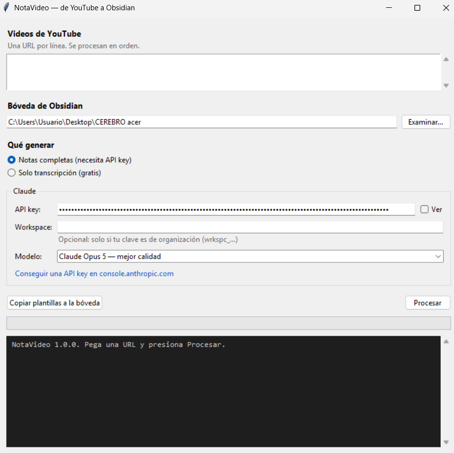

# NotaVideo — de YouTube a Obsidian

Pega la URL de un video de YouTube y obtén, en tu bóveda de Obsidian, la
transcripción limpia con marcas de tiempo, una nota de estudio estructurada y una
capa de repaso con preguntas de recuperación activa.

App de escritorio para Windows, en un `.exe` único sin instalación.

<p align="center">
  
</p>

---

## Qué hace

Por cada video genera hasta cuatro archivos:

| Archivo | Carpeta | Contenido |
|---|---|---|
| `<título> — transcripcion.md` | `Videos/Transcripciones/` | Transcripción limpia, en bloques de 45 s con marca de tiempo real |
| `<título>.md` | `Videos/` | Nota base: idea central, ideas clave, conceptos enlazados, datos, limitaciones del contenido |
| `<título> — Repaso.md` | `Videos/Repasos/` | Preguntas de recuperación activa con respuesta plegada, casos de aplicación y lista de comprobación |
| `<título>.mp4` | `Videos/Adjuntos/` | El video en sí, si activas la descarga |

Las notas usan enlaces internos `[[ ]]`, callouts de Obsidian y frontmatter con
etiquetas, así que se integran al grafo desde el primer momento.

## Dos modos

**Solo transcripción** — gratis, sin cuentas ni claves. Baja los subtítulos, los
limpia y los deja en la bóveda. Sirve tal cual para pegar en cualquier chat.

**Notas completas** — genera además la nota base y el repaso llamando a un modelo de
IA. Necesita una API key del proveedor que elijas.

## Descargar el video

Marca **Descargar también el video a la bóveda** y el archivo queda en
`Videos/Adjuntos/` con el mismo título que la transcripción, listo para incrustarlo
en cualquier nota con `![[título.mp4]]`.

La casilla es independiente del modo: puedes bajar el video sin gastar en IA, o
generar las notas sin bajarlo. Elige entre 1080p, 720p, 480p o **solo audio**
(`.m4a`), útil para escuchar de nuevo sin ocupar cientos de megas.

Dos decisiones que notarás al usarlo:

- **Un video ya descargado no se vuelve a bajar.** Si repites una URL, la app
  detecta el archivo y sigue de largo, en vez de gastar otra vez el ancho de banda.
- **Que falle la descarga no te cuesta las notas.** El video se baja en su propio
  paso; si YouTube lo bloquea o se acaba el disco, las notas ya generadas se
  conservan y el error queda en el registro.

> [!warning] Ojo con el peso y con la sincronización
> Una charla de una hora en 1080p ronda los 500 MB. Si tu bóveda se sincroniza con
> Obsidian Sync, iCloud o Drive, conviene excluir `Videos/Adjuntos/` o usar la
> opción de solo audio.

Descarga videos que puedas usar legítimamente: los tuyos, los de licencia abierta o
los que descargues para uso personal donde tu legislación lo permita.

## Proveedores

En Opciones eliges con qué IA trabajar. Vienen preparados Anthropic, OpenAI, DeepSeek,
Google (Gemini), Groq, Mistral, xAI, OpenRouter y Ollama, y **cualquier otro servicio
compatible con OpenAI** pegando su URL base: eso cubre a casi toda la industria.

| Campo | Para qué sirve |
|---|---|
| Proveedor | Rellena la URL y sugiere modelos |
| URL base | Editable salvo en Anthropic, que resuelve la suya |
| API key | La del proveedor elegido |
| Modelo | Escribible: cada proveedor renombra los suyos a su ritmo |
| Workspace | Solo Anthropic, y solo con claves de organización |

Cada proveedor recuerda su clave, su URL y su modelo por separado, así que puedes
alternar entre ellos sin volver a escribirlos.

Con **Ollama** el modelo corre en tu propio PC: gratis, sin conexión y sin cuenta
(la API key puede ser cualquier texto).

### Costo

Es de pago por uso, salvo Ollama. Medido sobre una charla TED de 16 minutos con 2.455
palabras de transcripción: **US$ 0,43 con Opus 5**, contando las dos llamadas. Da del
orden de US$ 0,03 por minuto de video; Sonnet 5 cuesta alrededor de la mitad.

La app estima el gasto solo cuando conoce la lista de precios del proveedor. Para el
resto informa los tokens consumidos: cada empresa cambia sus tarifas por su cuenta y
una tabla desactualizada engañaría más de lo que ayuda.

Tus claves se guardan solo en tu equipo, en `%APPDATA%\NotaVideo\config.json`, y no
se envían a ningún sitio salvo al proveedor que elijas.

## Instalación

**Opción rápida:** descarga `NotaVideo.exe` desde
[Releases](https://github.com/counterdev/youtube-a-obsidian/releases) y ábrelo.
No requiere Python ni instalación.

**Desde el código:**

```
git clone https://github.com/counterdev/youtube-a-obsidian
cd youtube-a-obsidian
iniciar.bat
```

`iniciar.bat` crea el entorno virtual, instala las dependencias y abre la app.
Para generar el ejecutable, `construir-exe.bat`.

## Uso

1. Pega una o varias URLs, una por línea.
2. Elige la carpeta de tu bóveda de Obsidian.
3. Elige el modo, marca si quieres el video y presiona **Procesar**.

## Los prompts se pueden editar

La estructura de las notas la definen dos plantillas incluidas en `prompts/`:

- **Prompt A** convierte la transcripción en la nota base.
- **Prompt B** convierte esa nota en la capa de estudio.

El botón **Copiar plantillas a la bóveda** las deja en `Plantillas/` dentro de tu
bóveda. Si están ahí, la app usa tu versión en vez de la incluida, así que puedes
adaptarlas desde Obsidian —cambiar secciones, el idioma, el número de preguntas—
sin tocar el programa.

El diseño en dos etapas es deliberado: la capa de estudio se genera a partir de la
nota base, no de la transcripción. La nota es mucho más corta y ya viene depurada,
así que el repaso sale completo y no arrastra los errores del dictado.

## Detalles que importan

**Subtítulos del autor antes que automáticos.** La app pide primero los subtítulos
escritos por el autor y solo recurre a los automáticos si no existen. La mayoría de
las herramientas piden ambos a la vez y no distinguen cuál obtuvieron; aquí queda
registrado en el frontmatter, porque cambia cuánto puedes confiar en el texto.

**Limpieza del efecto scroll.** Los subtítulos automáticos de YouTube repiten en
cada bloque parte del anterior y traen una etiqueta por palabra. Sin limpiar, eso
multiplica el texto y degrada el resultado. Medido sobre un archivo real: 14.807 →
1.254 caracteres, un 92 % menos, sin perder contenido.

**Marcas de tiempo reales.** Los timestamps salen del archivo de subtítulos, nunca
los inventa el modelo. Si un video no los trae, las notas simplemente no los
incluyen.

**Videos en otro idioma.** Las notas salen siempre en español, aunque el video esté
en inglés: la transcripción cruda conserva el idioma original y la traducción ocurre
al redactar la nota. Cuando no hay subtítulos del autor, la app pide los automáticos
**en el idioma original del video**, no en español. Puede parecer al revés, pero las
pistas en español que YouTube ofrece para un video en inglés son una traducción
automática hecha sobre una transcripción también automática: se degrada dos veces.
Traducir a partir del original, con el contexto completo delante, da un resultado
bastante mejor.

## Limitaciones

- Solo videos que tengan subtítulos, propios o automáticos. No transcribe audio.
- Windows. El código es multiplataforma, pero el `.exe` y los `.bat` no.
- El `.exe` pesa más de 100 MB porque lleva ffmpeg dentro. Sin ffmpeg, YouTube solo
  entrega el video en la calidad que sirve con audio ya incorporado, unos 360p:
  desde el código, `winget install yt-dlp.FFmpeg` te deja igual que el `.exe`.
- YouTube cambia su sitio a menudo y el motor de descarga queda desactualizado. Si
  algo deja de funcionar, descarga la versión más reciente del `.exe`; desde el
  código, basta con `pip install -U yt-dlp`.
- La desduplicación descarta una línea repetida dentro de las 8 anteriores. En
  contenido hablado es lo correcto; en un video con estribillos puede comerse una
  repetición legítima.

## Licencia

MIT.

## Novedades de la versión 1.3.0

- Descarga opcional del video a `Videos/Adjuntos/`, en 1080p, 720p, 480p o solo audio.
- ffmpeg viaja dentro del `.exe`, así que la calidad alta funciona sin instalar nada.
- Un video ya descargado no se vuelve a bajar.
- La descarga es un paso aparte: si falla, las notas generadas se conservan.
- El modo consola acepta `--video` y `--calidad`.

## Correcciones de la versión 1.2.1

- Corregido el inicio del procesamiento en ambos modos.
- Se conservan el proveedor, modelo, URL y clave al procesar o cerrar la app.
- Ollama permite dejar la clave vacía. La descarga desde YouTube requiere conexión.
- Se validan la bóveda, el modelo y la URL antes de iniciar.
- Una respuesta de IA vacía se informa como error, sin guardar una nota vacía.
- Una tanda informa cuántos videos terminaron y cuántos fallaron.
- Copiar plantillas conserva las versiones que ya existen en la bóveda.

Verificación local: `python -m unittest -v test_notavideo`.
Las pruebas usan respuestas de IA simuladas y una bóveda temporal; no consumen saldo.
